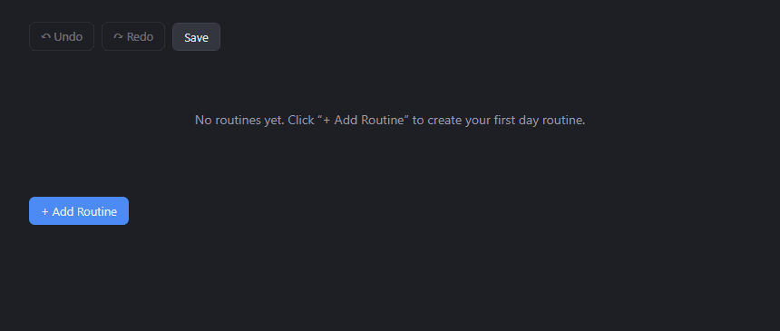

# Visual Routine Planner

A Windows desktop app for visually building day routines — 24-hour timelines of colored, titled time slots, built entirely by drag-and-drop. There are no dates: a routine represents an abstract "a day" (e.g. "Weekday", "Weekend"), not a calendar entry, and you can create as many as you want.



## Features

- **No dates** — every routine is a plain 24-hour timeline, not tied to a calendar.
- **Wake / sleep bounds** — set on a thin full-day overview bar per routine. The main timeline below it zooms to that range (plus a 1-hour blocked buffer on each side) so slots aren't squeezed into a tiny sliver of a full 24-hour bar.
- **Noon / 6pm reference lines** — a fixed red vertical line marks 12:00 PM and 6:00 PM on every timeline, always drawn behind slots so it's never in the way.
- **Time slots** — add colored, titled blocks between the wake and sleep bounds, either by clicking "+ Add Slot" or by clicking and dragging directly on empty timeline space. Each slot always shows its duration (e.g. "1h 30m") under its title.
- **Move and resize with no overlap** — drag a slot's edge to resize it (pushing into a neighbor shrinks that neighbor's edge to make room), or drag its body to slide it. Dragging the body works like reordering an iOS list: the moment you drag into another slot, the two trade places — each keeps its own original length — rather than squeezing anything, so slots can never overlap.
- **Undo / redo / save** — every add, delete, duplicate, move, resize, rename, and recolor can be undone and redone from the toolbar at the top of the app. The app autosaves continuously anyway; the Save button just flushes that immediately if you want the reassurance.
- **Select, rename, recolor, duplicate, delete** — click a slot to select it, double-click its title to rename it in place, and use its toolbar to change color, duplicate, or delete it (or just press Delete/Backspace on a selected slot).
- **Reusable custom colors** — any custom color you've picked for one slot shows up as a quick-pick swatch for every other slot, not just the 9 presets.
- **Duplicate a whole routine** — copies its wake/sleep bounds and every slot in one click.
- **30-minute units** — snapping, minimum slot size, and the background grid are all in 30-minute increments.
- **Unlimited routines** — add as many independent timelines as you want, stacked vertically.
- **Autosaves locally** — routines persist to a JSON file on disk, no account or internet connection required.

## Using the app

1. **Create a routine** — click **+ Add Routine** to add a new 24-hour timeline.
2. **Set wake/sleep** — drag the two handles on the thin overview bar (the glassy handles with a red center line) to set when the routine's day starts and ends. The main timeline below zooms to fit that range automatically.
3. **Add a time slot** — either click **+ Add Slot** (fills the next open gap), or click-and-drag directly on empty space in the main timeline to draw a slot at an exact time. New slots cycle through different colors automatically.
4. **Select a slot** — click it once. A toolbar appears below the slot:
   - 🎨 change its color (presets, plus any custom color used elsewhere, plus a picker for a new one)
   - ⧉ duplicate it
   - 🗑 delete it

   Click empty timeline space, press **Escape**, or select another slot to deselect. Press **Delete** or **Backspace** to delete whichever slot is currently selected.
5. **Rename a slot** — double-click its title text and type a new name.
6. **Move or resize a slot** — drag the middle of a slot to slide it earlier/later, or drag its left/right edge to resize it. Resizing into a neighbor shrinks that neighbor to make room; moving into a neighbor instead swaps places with it (like reordering a list) — each slot keeps its own length either way, so nothing ever overlaps.
7. **Rename, duplicate, or remove a routine** — edit the routine's name field directly, or use **Duplicate Routine** / **Delete Routine** in its header.
8. **Undo, redo, or save** — use the toolbar at the top of the app at any time.

All changes save automatically to disk as you make them.

## Tech stack

Electron + React + TypeScript, built with [electron-vite](https://electron-vite.org/) and packaged with [electron-builder](https://www.electron.build/). State is managed with [zustand](https://github.com/pmndrs/zustand); the scheduling logic (overlap resolution, gap-finding, snapping) lives in framework-free, pure functions.

## Getting started

Requires [Node.js](https://nodejs.org/) 18+.

```bash
npm install
npm run dev
```

This launches the app with hot reload for the renderer.

## Building

```bash
npm run typecheck   # type-check main/preload and renderer
npm run build        # production build of all processes (out/)
npm run dist          # package a Windows installer (release/)
```

`npm run dist` produces `release/Visual Routine Planner Setup <version>.exe` via electron-builder's NSIS target.

## Data storage

Routines are saved as a single JSON file at `%APPDATA%\visual-routine-planner\routines.json`. There's no cloud sync — back up that file if you want to keep a copy elsewhere.

## Project structure

- `electron/` — Electron main process and preload script (IPC + file persistence)
- `src/` — the React renderer app
- `shared/` — TypeScript types shared between main and renderer

See [`CLAUDE.md`](./CLAUDE.md) for a deeper architecture walkthrough.
